# AWS-EC2-Web-Hosting
A hands-on project demonstrating how to host a high-performance static website on AWS using an EC2 (Ubuntu 24.04) instance and Nginx web server. Includes end-to-end documentation from instance launching to deployment.

🎯 Project Objective
To setup an Nginx web server on an AWS EC2 (Ubuntu) instance and deploy a custom-designed HTML/CSS landing page.

🛠️ Steps Performed
1. Launching the EC2 Instance
I started by launching a new EC2 instance named Static-Website in the Ohio (us-east-2) region.

AMI: Ubuntu 24.04 LTS.

Instance Type: t3.micro (Free Tier eligible).

Key Pair: jigyasa-ohio.

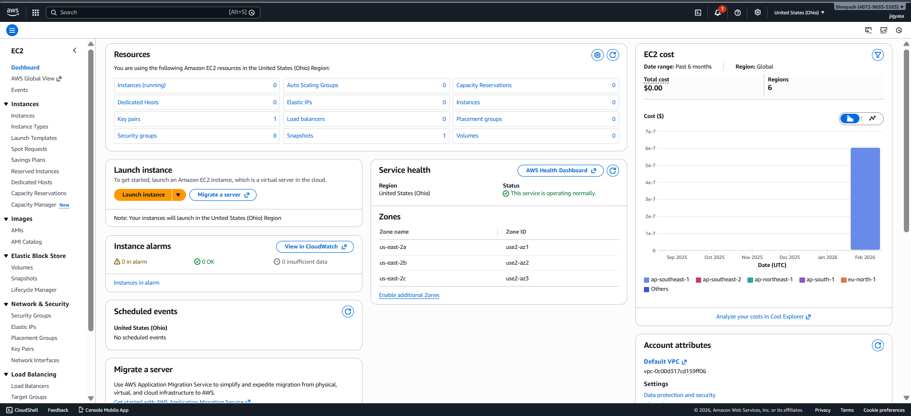
 
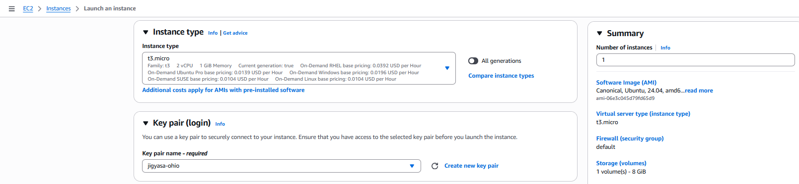
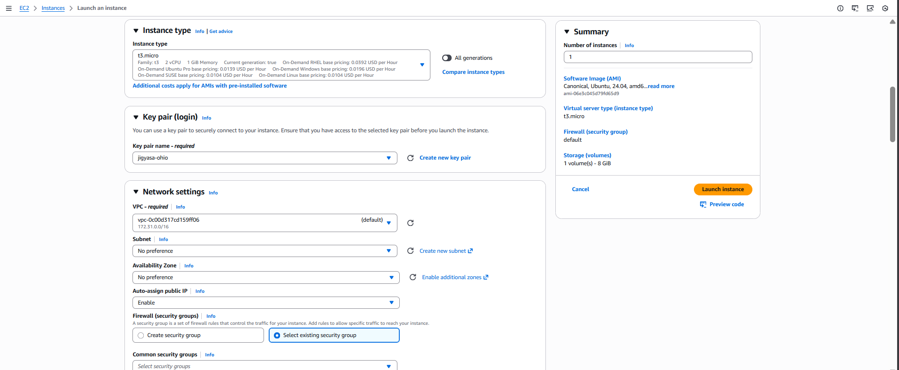
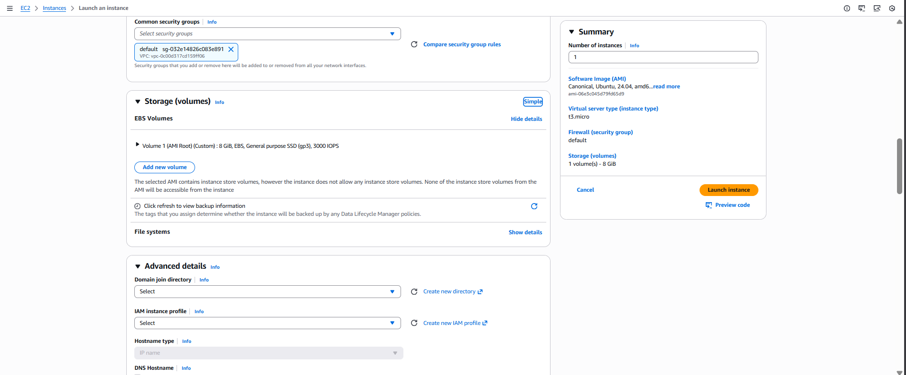
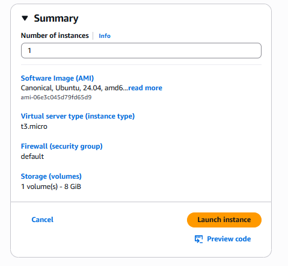

2. Configuring Security Groups
For the website to be accessible over the internet, I configured the Inbound Rules to allow:

SSH (Port 22): For remote access.

HTTP (Port 80): To allow web traffic.

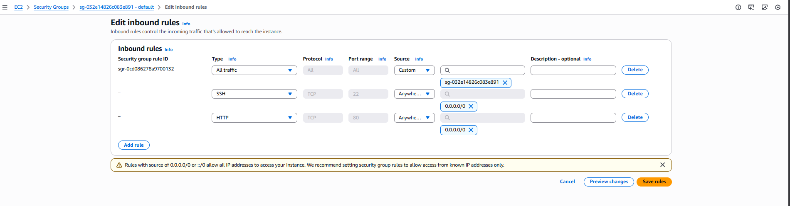

3. Connecting via SSH
Using PowerShell, I connected to my instance using the .pem key file.

ssh -i "jigyasa-ohio.pem" ubuntu@ec2-3-140-240-42.us-east-2.compute.amazonaws.com

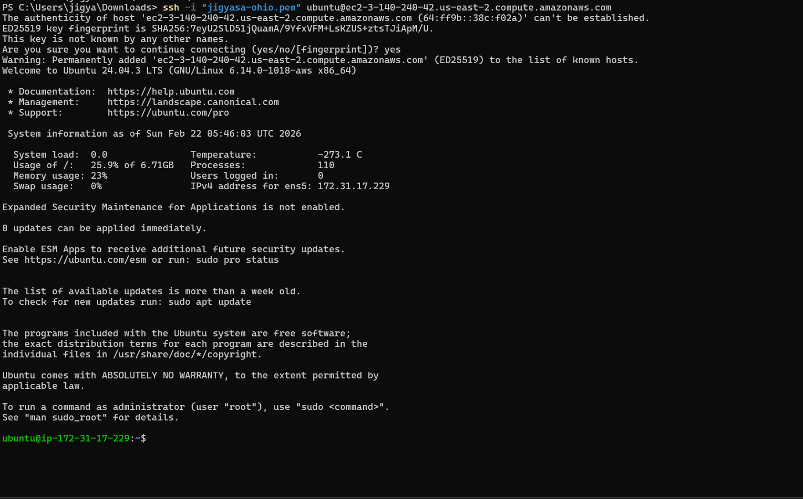

4. Installing Nginx Web Server
Once logged in, I updated the system packages and installed Nginx.

sudo apt update
sudo apt install nginx -y
I verified that Nginx was running using **systemctl status nginx**.
Check Server by **curl localhost** or Hit Public IP on the Browser.

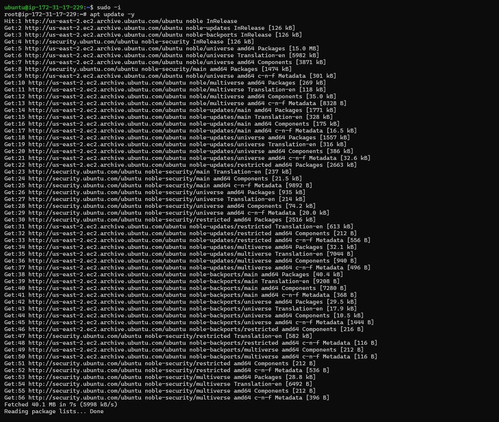
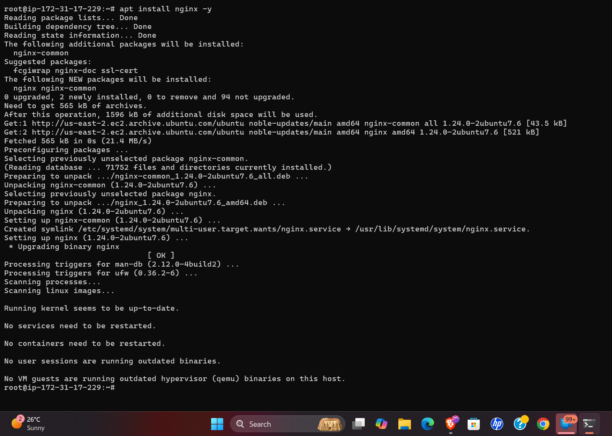
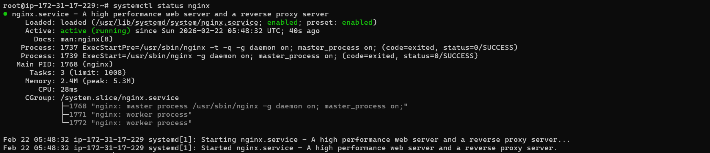

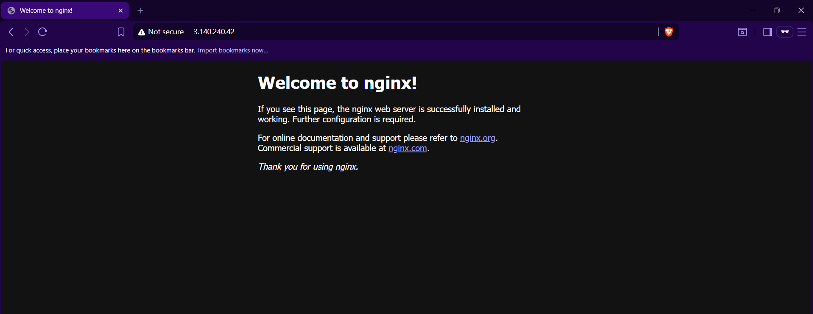

5. Deploying Custom HTML
I created a custom index.html file with internal CSS using the vim editor and then moved it to the Nginx root directory.

Root Path: /var/www/html/

# Copying file to root path
sudo cp index.html /var/www/html/index.html

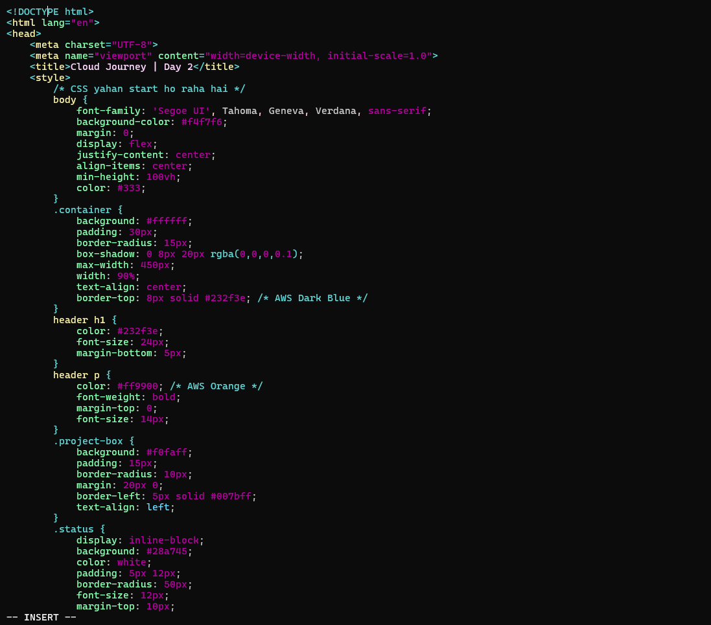
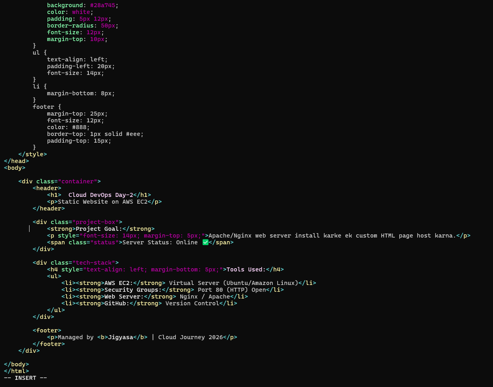
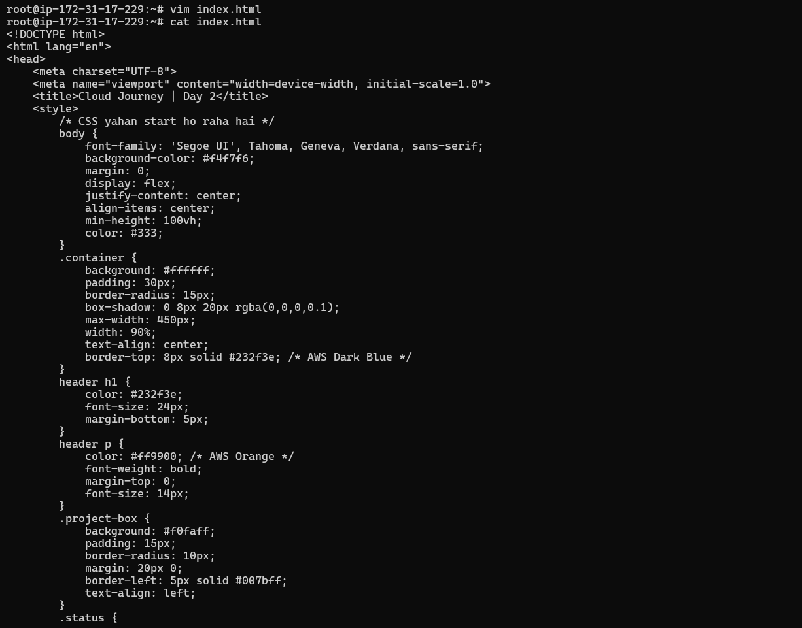
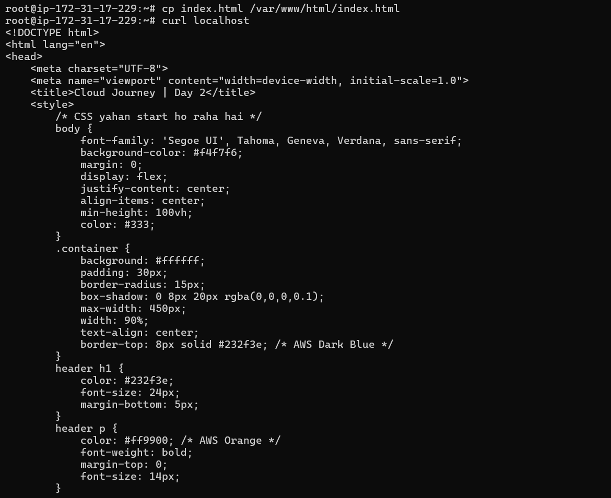

# Verifying locally
curl localhost
🚀 Final Output
The website is now live and accessible via the Public IP of the EC2 instance!

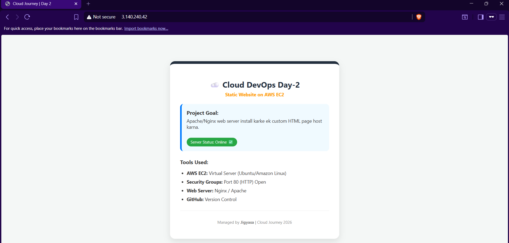

6. Automation via Bash Script (Optional but Recommended)
To streamline the deployment process, I created a Bash script that automates the entire setup. This can be used in the AWS User Data section during instance launch.

Script: installation_nginx.sh

This script performs the following actions:
Updates system packages.
Installs the Nginx web server.
Starts and enables the Nginx service.
Deploys the custom HTML/CSS content automatically.

You can find the complete automation script here: (installation_nginx.sh)

# How to execute the script:
Grant execution permissions:
**chmod +x install_nginx.sh**

Run the script:
**./install_nginx.sh**

---
💡 Key Learnings
Understanding the Nginx default root directory.
Importance of Port 80 in Security Groups.
Using curl to verify web server status from the CLI.

Managed by Jigyasa | 2026
